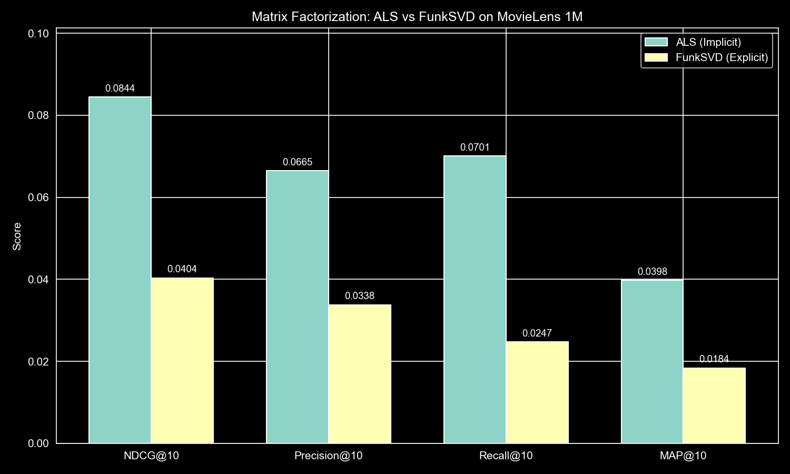
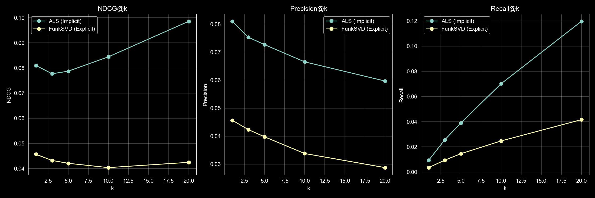
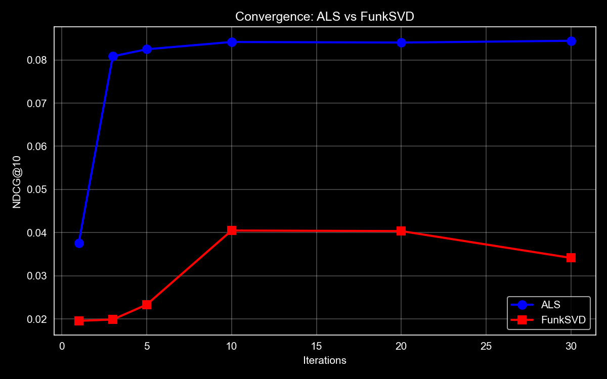

# Matrix Factorization

We implemented two matrix factorization approaches: ALS (Alternating Least Squares) with implicit feedback and FunkSVD with explicit ratings.

## Results

| Model | NDCG@10 | Precision@10 | Recall@10 | RMSE |
|-------|---------|--------------|-----------|------|
| ALS (Implicit) | 0.0844 | 0.0665 | 0.0701 | N/A |
| FunkSVD (Explicit) | 0.0404 | 0.0338 | 0.0247 | 0.886 |

ALS outperforms FunkSVD on all ranking metrics by roughly 2x.

## Metrics vs K

ALS beats FunkSVD at every k value. Precision drops as k grows (more recommendations = harder to stay precise), while recall increases (more chances to hit relevant items). This is the standard precision-recall tradeoff. NDCG accounts for ranking position, so it stays more stable across different k values.

## Convergence Analysis

ALS converges quickly and stays stable - the closed-form solution with regularization keeps it from overfitting. FunkSVD peaks around 10-20 iterations then drops, a sign of overfitting: it keeps minimizing training RMSE but that hurts ranking quality on test data. This shows why early stopping matters for SGD methods, and why optimizing for rating prediction doesn't directly translate to good recommendations.

## Discussion

ALS (implicit) outperforms FunkSVD on ranking metrics because it's optimized for the ranking task directly. FunkSVD tries to predict exact rating values which doesn't necessarily translate to good rankings. ALS treats ratings >= 4 as positive signals and learns what users prefer, while FunkSVD treats a 3-star and 5-star rating very differently even though both might indicate interest.

The choice of collaborative filter should account for these differences. But one of the crucial differences between the two, is that ALS is parallelizable and can run on multiple instances.
