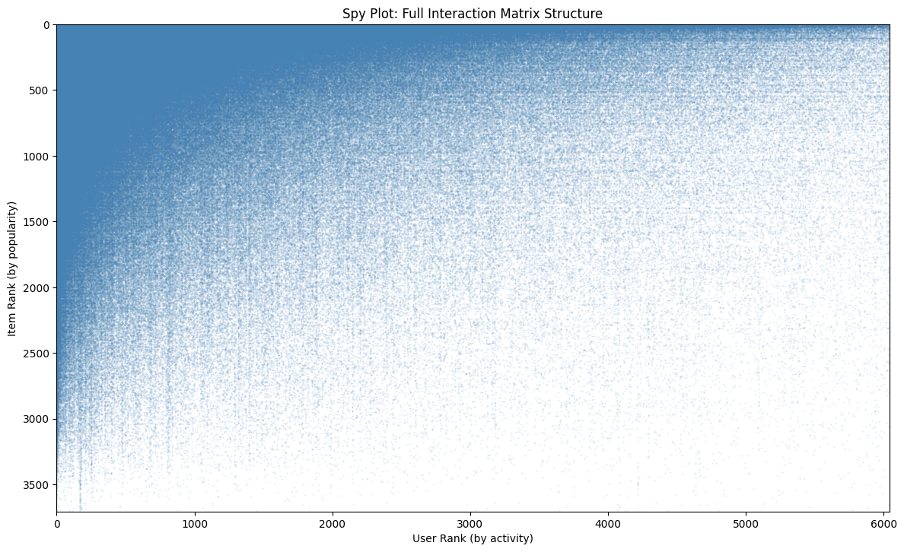
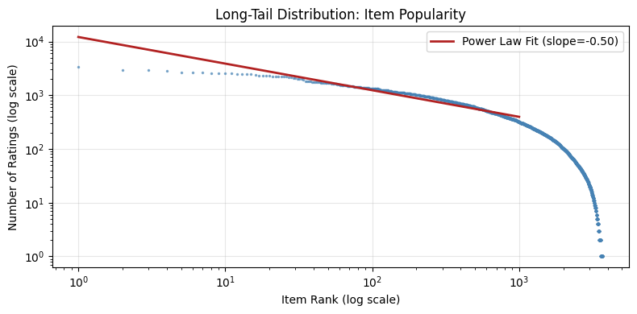

# Final Report

# 1. Introduction

This project examines traditional recommender system methods using the MovieLens 1M dataset. This dataset is an industry standard and includes one million ratings from 6,040 users across 3,706 movies. We chose this dataset because it offers interaction timestamps needed for time-based evaluation, genre metadata useful for content-based methods, and enough scale to test different algorithm choices. Its common use in research allows us to compare our results with established benchmarks. The main question guiding this work is how similarity-based methods stack up against matrix factorization when evaluated under realistic conditions that consider temporal order.

The report is organized as follows. First, we summarize important insights from exploratory data analysis that inform modeling decisions. Next, we describe the offline evaluation framework, including the temporal split strategy and metrics. The following sections detail the implementations of content-based filtering, collaborative filtering, FunkSVD, and Alternating Least Squares, along with experimental results. The report ends with a comparative analysis, deployment recommendations, and noted limitations. Throughout, we focus on ranking quality, measured by nDCG@10, as the main optimization target.

# 2. Exploratory Data Analysis

- Detailed report: `reports/1-exploratory-data-analysis.md`
- Notebook: `experiments/exploratory-data-analysis.ipynb`

The most remarkable feature of this dataset is its sparsity. Only 4.47% of user-item pairs have ratings, leaving 95.5% of the interaction matrix empty. This sparsity directly affects model selection. When we looked at user-pair overlap, the median number of co-rated items was only 9. Such low overlap makes memory-based collaborative filtering unreliable. Similarity estimates based on fewer than 10 shared items contain a lot of noise. Singular value decomposition of the rating matrix showed no clear elbow point, with over 50 components needed to capture even 30% of the variance. This high-dimensional preference structure indicates that users have truly diverse tastes that cannot be simplified to just a few latent factors.

Two data issues need to be addressed. First, item popularity follows a power-law distribution with a slope of -1.48 on a log-log scale. The top 20 movies make up about 5% of all ratings, even though they represent less than 1% of the catalog. This concentration risks naive models focusing on popularity instead of learning personalization. Second, 12% of items have fewer than 10 ratings, putting them in a cold-start situation where collaborative signals are not enough. Genre metadata serves as a backup for these items, but the 18-genre taxonomy only provides rough similarity.

The time structure of the dataset allows for evaluation based on time. The average rating stayed steady at 3.58 over the 2.8-year collection period, showing no noticeable changes. However, the time split reveals a significant cold start during evaluation: 60% of users in the validation set and 38% in the test set were not part of the training. This situation is realistic, but it requires that models offer reasonable recommendations for users with no history, either through content-based alternatives or popularity-based defaults.

# 3. Offline Evaluation Strategy

- Detailed report: `reports/2-offline-evaluation-strategy.md`
- Notebook: `experiments/metrics-example.ipynb`

We use a chronological split with a 70/15/15 ratio for training, validation, and test sets. Ratings are arranged by timestamp. The earliest 70% makes up the training set, the next 15% is the validation set, and the final 15% is the test set. This method avoids data leakage by ensuring that models do not see future interactions during training. A random split would let the model access ratings that come after those it needs to predict, which would falsely boost performance estimates. The cold-start exposure mentioned earlier is a real challenge that systems in the real world must manage. 

The main evaluation task focuses on ranking, not predicting ratings. Users engage with ordered recommendation lists instead of numerical scores, so the quality of the ranking gives a better idea of practical usefulness. We use nDCG@10 as the primary metric because it gives more importance to relevant items based on their position in the ranking, rewards hits that appear earlier, and provides scores between 0 and 1 that can be compared across users with different numbers of relevant items. The table below outlines the complete metrics framework.

| Metric | Category | Purpose |
|--------|----------|---------|
| nDCG@10 | Ranking (Primary) | Position-weighted relevance normalized to [0,1]; primary optimization target |
| MAP@10 | Ranking | Average precision emphasizing early hits |
| Precision@10 | Ranking | Fraction of top-10 recommendations that are relevant |
| Recall@10 | Ranking | Fraction of relevant items appearing in top-10 |
| RMSE | Rating | Root mean squared error for rating calibration diagnostics |
| MAE | Rating | Mean absolute error, more robust to outliers |
| Coverage | Beyond-accuracy | Fraction of catalog recommended; detects popularity bias |
| Novelty | Beyond-accuracy | Measures recommendation of less popular items |

All metrics are computed using the Microsoft recommenders library version 1.2.1 to ensure reproducibility and consistency with published benchmarks.

This evaluation framework measures a model's ability to rank relevant items based on historical interaction patterns. However, it does not address several important aspects of production systems. Online feedback loops, where recommendations affect later user behavior, are not captured by offline metrics. Long-term user satisfaction may differ from short-term ranking accuracy, especially if users prioritize surprise or variety over time. Preferences that depend on context, such as time of day, mood, or social situation, cannot be evaluated using this dataset. Therefore, offline evaluation is necessary for filtering candidate approaches, but it is not enough for making final deployment decisions.

# 4. Similarity-Based Recommenders

# 5. Matrix Factorization

# 6. Summary and Analysis
