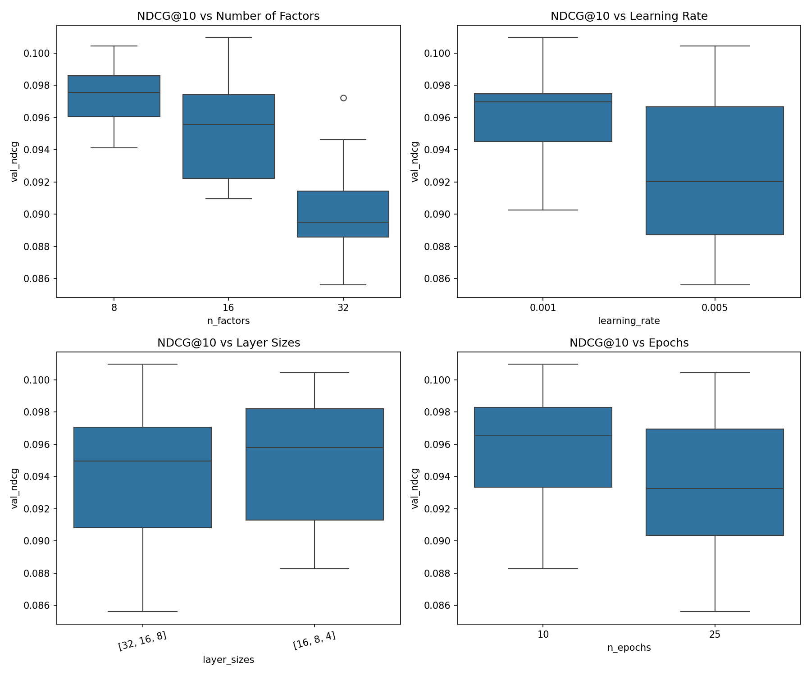
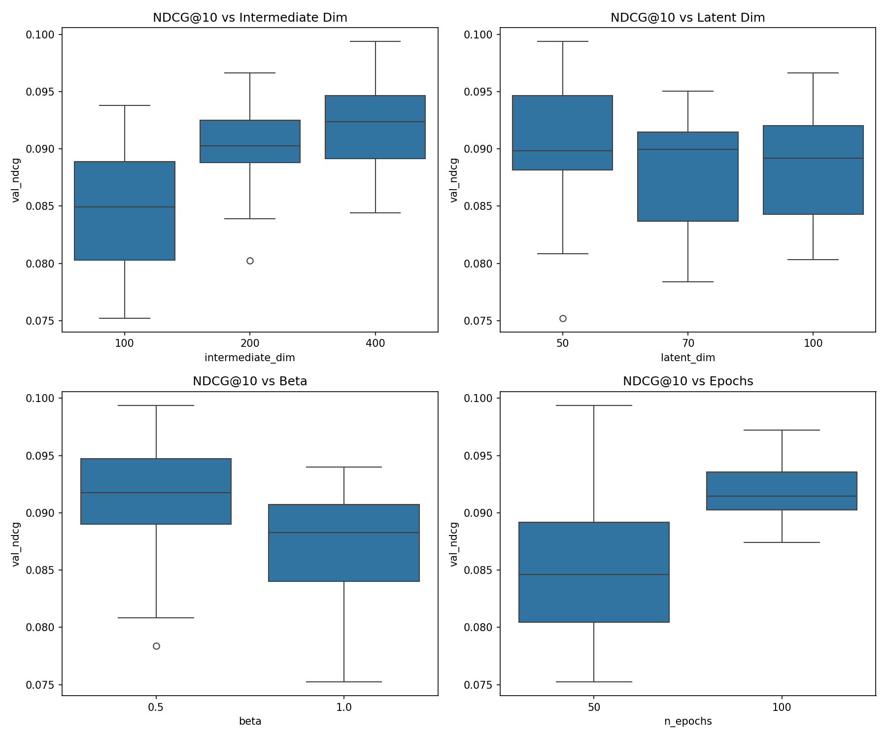

# Deep Learning Recommenders

Two deep learning approaches: Neural Collaborative Filtering (NCF) and Multinomial Variational Autoencoder (MultVAE). Both operate on implicit feedback (ratings >= 4 as positive interactions), matching the ALS setup.

## Architectures

NCF follows the NeuMF architecture: a GMF component models linear user-item interactions through element-wise embedding products, while an MLP captures non-linear patterns through stacked dense layers. The two pathways are concatenated and fed through a sigmoid prediction layer. Unlike matrix factorization, NCF can learn arbitrary non-linear interaction functions between embeddings.

MultVAE encodes each user's full interaction history through a bottleneck: the encoder maps the sparse binary vector to a latent Gaussian via the reparameterization trick, and the decoder reconstructs item scores from sampled latent codes. The loss combines multinomial negative log-likelihood with KL divergence weighted by a tunable beta. This generative framing scores the entire item catalog in a single forward pass.

## Hyperparameters

Both models were tuned via grid search optimizing for validation NDCG@10 (NCF: 24 combinations, MultVAE: 36). During tuning, validation metrics were computed on a random sample of 1,000 users for efficiency, since per-user recommendation generation is the bottleneck — especially for NCF's session-based prediction. Final test metrics were computed on all test users after retraining the best configuration on the combined train+validation set.

| Model | Parameters |
|-------|------------|
| NCF (NeuMF) | n_factors=16, layer_sizes=[32, 16, 8], n_epochs=10, learning_rate=0.001 |
| MultVAE | intermediate_dim=400, latent_dim=50, n_epochs=50, beta=0.5 |

NCF favors moderate embeddings — factors of 8 and 16 outperform 32, mirroring the sparsity-driven pattern from matrix factorization. The best configuration converges in just 10 epochs. For MultVAE, a wider intermediate layer (400) is needed to represent the 3,706-item input before compressing to the latent space. Beta=0.5 down-weights the KL term, prioritizing reconstruction quality over latent smoothness — a trade-off that consistently improves ranking.

## Results

| Model | NDCG@10 | MAP@10 | Precision@10 | Recall@10 |
|-------|---------|--------|--------------|-----------|
| NCF (NeuMF) | 0.1099 | 0.0549 | 0.0855 | 0.0858 |
| MultVAE | 0.1015 | 0.0495 | 0.0805 | 0.0816 |

NCF outperforms MultVAE by ~8%. Both substantially beat ALS (0.0844) and FunkSVD (0.0404), but neither approaches item-item CF (0.1488).

## Hyperparameter Sensitivity

### NCF

Factor count has the clearest effect: 8 and 16 cluster around 0.096-0.100 NDCG, while 32 drops to 0.089 with more variance — over-parameterization on sparse data. Learning rate 0.001 beats 0.005; layer sizes and epoch count have relatively small effects once embedding dimension and learning rate are set.

### MultVAE

Intermediate dimension dominates: 100 to 400 hidden units shifts median NDCG from 0.084 to 0.092. Latent dimension matters less (50, 70, 100 perform similarly). Beta=0.5 consistently outperforms 1.0, and 100 epochs slightly beats 50.

## Discussion

The deep learning models sit between matrix factorization and item-item CF. Non-linear representations improve over ALS's linear factors by 30%, but item-item CF computes exact similarity over full interaction vectors without compressing through a bottleneck. With only 3,706 items, that direct computation is tractable and retains more signal than any learned embedding. Deep learning's representational advantage doesn't compensate for this information loss.

Training efficiency differs drastically. MultVAE trains in under 15 seconds per configuration because it processes users in batches through a single network. NCF requires 280-700 seconds due to its TF1 session-based negative sampling. In production, MultVAE's batch inference (all items scored in one forward pass) would also be more efficient than NCF's pairwise approach.
