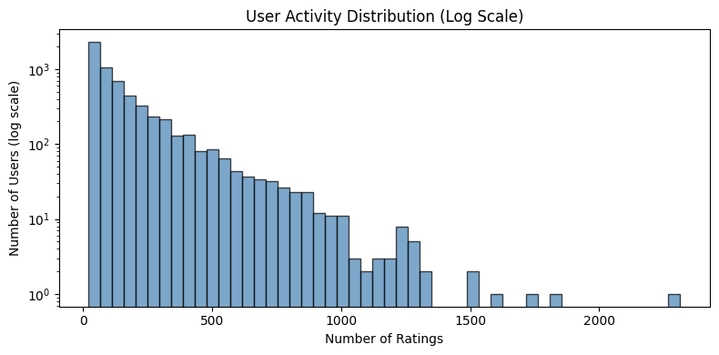
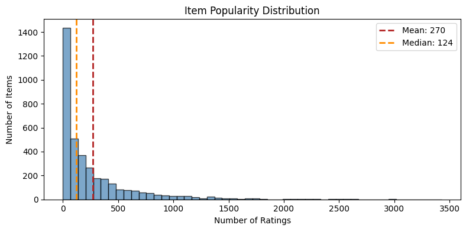
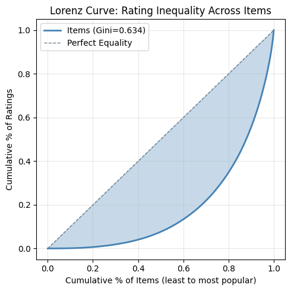
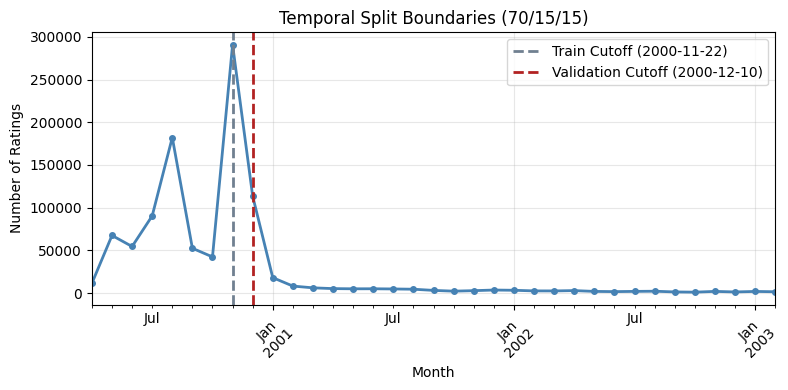
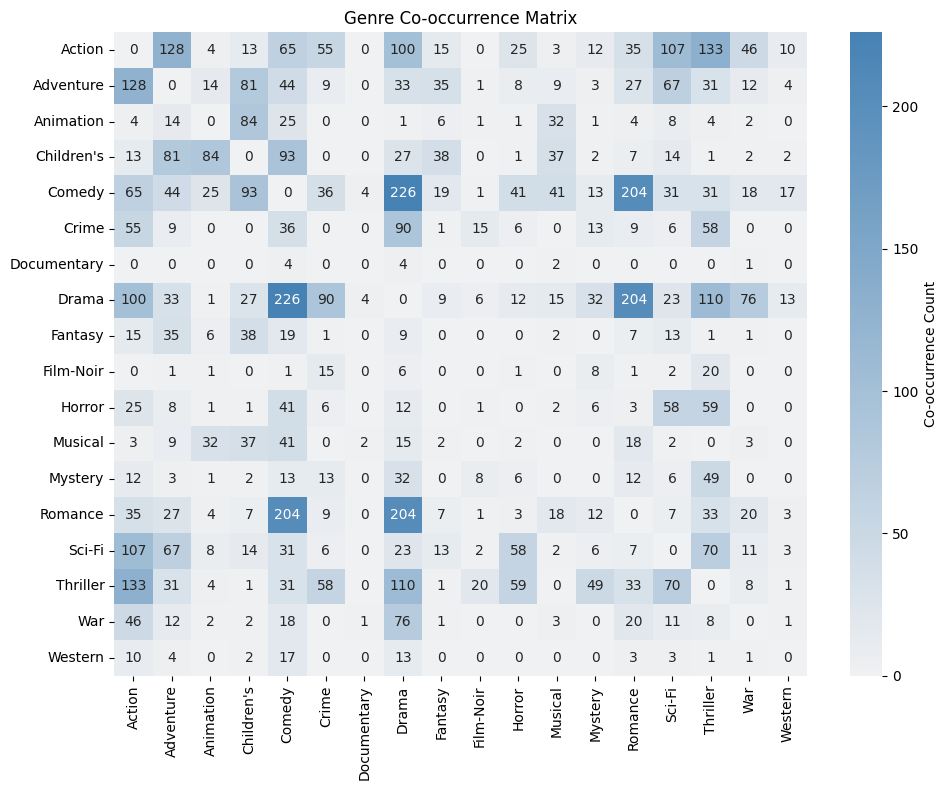
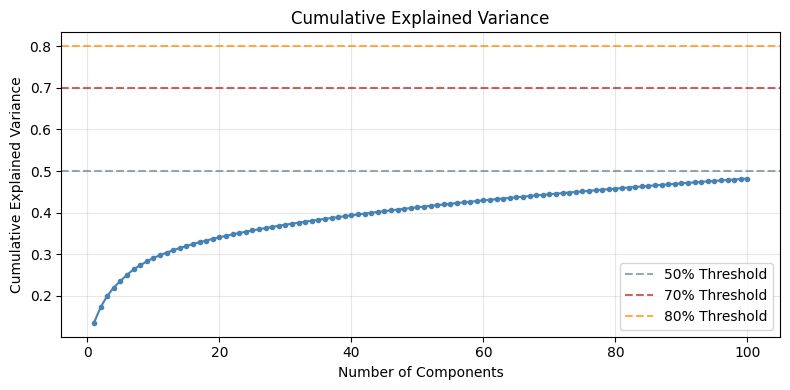

# Exploratory Data Analysis

## Executive summary

This report summarizes the exploratory data analysis done on the MovieLens 1M dataset. It includes 1,000,209 ratings from 6,040 users across 3,706 movies from April 2000 to February 2003. The dataset shows features typical of recommender systems. It has extreme sparsity, with 95.5% of the user-item matrix being empty. It also has a strong popularity skew that follows a power-law distribution.

Two main data issues affect our modeling strategy. First, popularity bias means that a small number of blockbuster movies get most of the ratings. This bias can lead naive models to over-recommend popular items and ignore personalization. Second, item cold-start impacts 12% of movies that have fewer than 10 ratings. This makes collaborative filtering unreliable for those items and requires using fallback mechanisms based on content.

The analysis shows that matrix factorization methods work better than memory-based collaborative filtering because of the sparse interaction matrix. The temporal patterns remain stable throughout the dataset's life. This stability supports a time-based train/validation/test split strategy. Genre metadata serves as a good base for content-based filtering, but its predictive power is limited to categorical similarity.

## Dataset overview

The MovieLens 1M dataset was collected by the GroupLens research group. It contains explicit feedback in the form of 1-5 star ratings. Each user has rated at least 20 movies. This approach solves the user cold-start problem. However, it creates a dataset that may not match real-world scenarios where new users start with no history.

The interaction matrix includes 6,040 users and 3,706 items, excluding 177 "ghost" movies that are in the catalog but have never been rated. With just over one million ratings, the matrix density is 4.47%. This means collaborative filtering algorithms need to generalize from observing less than 5% of possible user-item pairs.

| Metric | Value |
|--------|-------|
| Total Ratings | 1,000,209 |
| Users | 6,040 |
| Items (with ratings) | 3,706 |
| Matrix Density | 4.47% |
| Rating Scale | 1-5 stars |
| Global Mean Rating | 3.58 |
| Time Span | 2.8 years |

## Interaction sparsity analysis

The sparse user-item matrix presents a key challenge for collaborative filtering. When looking at pairs of users sampled from 1,000 users, the median number of items they both rated is just 9. Additionally, 30.7% of user pairs have fewer than 5 items in common. This small overlap makes estimates of user similarity unreliable, since cosine or Pearson correlations calculated from only a few items have high variance.

The spy plot above shows the rating matrix. Users are sorted by activity level, and items are sorted by popularity. You can clearly see that many ratings cluster in the upper-left corner, where active users rate popular items. In contrast, the lower-right corner has very few ratings. This pattern indicates that methods based on similarity will work well for active users and popular items, but will quickly lose effectiveness for less common ones.

When choosing a model, this sparsity pattern supports matrix factorization methods. They learn hidden representations that can generalize beyond what has been seen. Memory-based methods, like user-user or item-item nearest neighbors, should set minimum overlap thresholds to prevent unreliable similarity estimates.

## Activity distributions

User activity and item popularity both follow heavy-tailed distributions. The means are much higher than the medians because of a small group of very active participants.

### User activity

Users rate between 20 and 2,314 movies, with a mean of 165.6 and median of 96. The 20-rating minimum is artificial (dataset curation), but the long tail of power users who rate hundreds of movies is genuine. These power users contribute disproportionately to model training and may skew learned preferences.

### Item popularity

Movies receive between 1 and 3,428 ratings, with an average of 269.9 and a median of 123.5. The difference between the average and median shows the blockbuster effect, where a few popular films gather most of the ratings.

### Rating behavior

Users show consistent personal biases in how they rate. The average ratings per user vary significantly around the global average of 3.58. This suggests that user bias terms will reflect real trends. Notably, just 0.28% of users have low rating variance, meaning their standard deviation is below 0.5. This indicates that almost all users give varied ratings instead of sticking to the same scores.

These patterns play a key role in shaping the model design. User and item bias terms are crucial for capturing the general tendency of lenient users to give higher ratings and of quality items to earn better scores, regardless of how the user and item interact.

## Data pathologies

### Popularity skew

Item popularity follows a power-law distribution with a slope of -1.48 on a log-log scale. The top 20 movies, including American Beauty, Star Wars trilogy, Jurassic Park, Saving Private Ryan, Terminator 2, and The Matrix, account for about 5% of all ratings, even though they make up less than 1% of the catalog.

The Lorenz curve measures inequality. A small number of items gets most of the total interactions. This concentration of popularity creates a feedback loop. Models trained on past data tend to recommend items that are already popular. This can lead to a loss of personalization in favor of safer predictions.

Standard accuracy metrics (RMSE, precision@k) will be dominated by performance on popular items. To assess whether models provide genuine personalization, evaluation should stratify results by item popularity tier and potentially incorporate diversity or novelty metrics.

### Cold-start problem

While the system is designed to avoid user cold-start issues by requiring a minimum of 20 ratings per user, item cold-start remains a significant challenge. The item catalog breaks down as follows: 12.0% are cold items (fewer than 10 ratings), 20.1% are warm items (10-49 ratings), and 67.8% are popular items (50 or more ratings). The 446 cold items cannot be reliably recommended through collaborative filtering alone.

Content-based methods that use genre metadata offer a necessary fallback for cold items. However, genre similarity is a rough indicator; two drama films can be very different in tone, era, and audience appeal. The evaluation framework should track performance separately for cold, warm, and popular items to see where models work well and where they don't.

## Temporal dynamics

Ratings cover the period from April 25, 2000, to February 28, 2003, with the highest activity occurring in 2001, when there were about 400,000 ratings. The dataset shows a natural collection period instead of a sudden influx, which makes it suitable for temporal splitting.

The volume of ratings varies from month to month, but the average rating stays steady at around 3.58 throughout the collection period. This lack of concept drift, which refers to changes in user preferences or rating standards over time, makes modeling easier since we do not have to consider changes in tastes.

The temporal 70/15/15 split yields 700,144 training ratings, 150,033 validation ratings, and 150,032 test ratings. Critically, this split introduces cold-start conditions during evaluation: 60% of validation users and 38% of test users never appeared in training. Models must handle these unseen users through fallback strategies (popularity-based recommendations, content-based filtering, or global mean predictions).

## Content metadata analysis

Each movie is tagged with one or more of 18 genres: Action, Adventure, Animation, Children's, Comedy, Crime, Documentary, Drama, Fantasy, Film-Noir, Horror, Musical, Mystery, Romance, Sci-Fi, Thriller, War, and Western. Drama and Comedy make up most of the catalog, while Film-Noir and Documentary are not common.

Most movies have multiple genre tags, showing the complex nature of film content. The patterns of genre co-occurrence show clear connections: Action often pairs with Adventure and Sci-Fi, while Comedy frequently pairs with Romance. These co-occurrences can help with content similarity calculations.

For content-based filtering, binary genre vectors provide a simple way to represent items. Cosine similarity across these vectors gives useful but rough differentiation. Movies that share genres will have a non-zero similarity, no matter their other qualities. This representation works for cold-start fallback but won't capture detailed user preferences. The strong presence of Drama and Comedy can skew content-based recommendations towards these dominant genres.

## Latent structure analysis

Truncated SVD on the centered rating matrix shows the number of dimensions needed to capture user-item interaction patterns. The variance decomposition reveals a steady buildup. Twelve components explain 30% of the variance, 44 components explain 40%, and over 100 components are necessary to exceed 50%.

This gradual curve shows that user preferences are genuinely high-dimensional. There is no small set of "taste factors" that explains most of the variation. Each added latent dimension contributes modestly but meaningfully. The practical implication is that matrix factorization models should use 50 to 100 latent factors. The exact number should be determined through validation performance.

The high-dimensional latent structure, together with the sparse observation matrix, creates a risk of overfitting. Regularization, such as L2 penalties on factor magnitudes, is essential to prevent models from memorizing training interactions instead of generalizing.

## Modeling implications

The EDA findings translate into concrete guidance for implementing similarity-based and matrix factorization recommenders.

### Bias terms

User and item biases account for significant differences in ratings, regardless of the user-item match. All models should include separate bias terms: predicted rating = global mean + user bias + item bias + interaction term.

### Model selection

The 95.5% sparsity and low user-pair overlap (median 9 co-rated items) make nearest-neighbor methods unreliable for many user pairs. Matrix factorization can generalize across the sparse matrix by learning dense latent representations. For user-user or item-item collaborative filtering, we recommend enforcing a minimum overlap threshold of at least 10 co-rated items to get stable similarity estimates.

### Latent dimensionality

The SVD analysis does not reveal a clear elbow point. Variance increases steadily. We suggest beginning with 50 factors and adjusting upward if validation performance gets better. Regularization is essential because of the high dimensionality and sparse observations.

### Cold-start handling

The 12% of cold items and 60% of cold users in validation need non-collaborative predictions. Genre-based content similarity offers a basic option, while popularity-based recommendations serve as the final fallback when no other signals are available.

### Evaluation strategy

Overall metrics will be influenced by popular items. We suggest reporting performance separately for cold, warm, and popular item tiers. This will show whether models really provide personalization or just take advantage of popularity. Time-based splits are suitable because of stable patterns over time; random splitting would reveal future information.

## Appendix: Key statistics

| Category | Metric | Value |
|----------|--------|-------|
| **Scale** | Users | 6,040 |
| | Items (rated) | 3,706 |
| | Ratings | 1,000,209 |
| | Density | 4.47% |
| **Ratings** | Global Mean | 3.58 |
| | Scale | 1-5 |
| **User Activity** | Mean | 165.6 |
| | Median | 96.0 |
| | Range | 20 - 2,314 |
| **Item Popularity** | Mean | 269.9 |
| | Median | 123.5 |
| | Range | 1 - 3,428 |
| **Cold-Start** | Cold Items (<10 ratings) | 12.0% (446) |
| | Warm Items (10-49) | 20.1% (746) |
| | Popular Items (50+) | 67.8% (2,514) |
| **Temporal** | Time Span | Apr 2000 - Feb 2003 |
| | Train/Val/Test Split | 70/15/15 |
| | Cold Users in Validation | 60% |
| **Content** | Genres | 18 |
| | Ghost Items | 177 |
| **Latent Structure** | Components for 30% variance | 12 |
| | Components for 40% variance | 44 |
