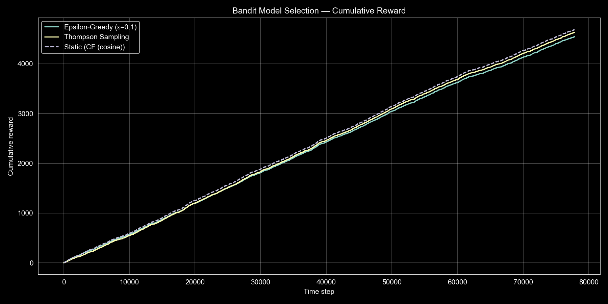
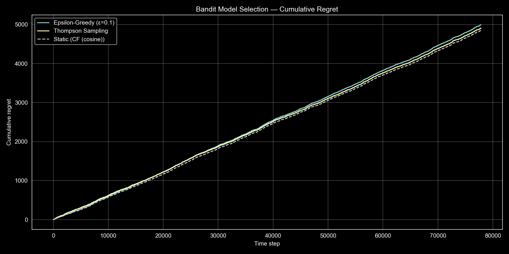
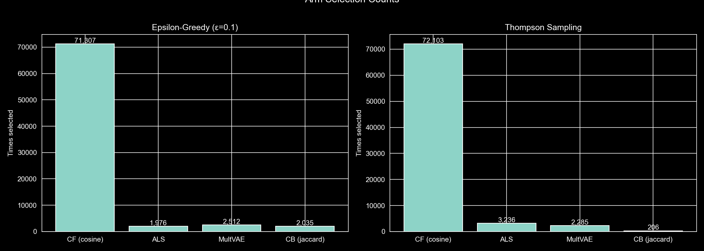
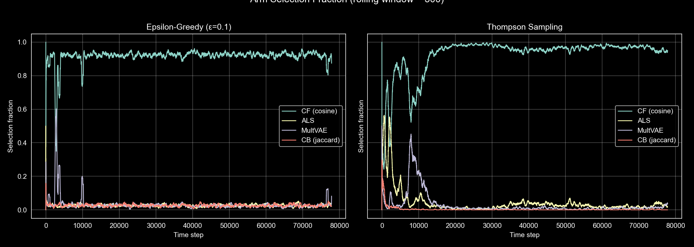

# Online Evaluation: A/B Testing and Bandits

While offline evaluation measure ranking quality against held-out data, they cannot capture how users respond to recommendations. This in turn creates feedback loops. Here we two approaches to online evaluation — a designed A/B test for comparing candidate models, and bandit algorithms that dynamically allocate traffic.

## A/B Test Design

We design an A/B test to compare the current best offline model (item-item CF with cosine similarity, NDCG@10 = 0.1488) against NCF (NDCG@10 = 0.1099). The rationale is while the offline performance favors CF,  our metrics cannot account for user engagement, satisfaction, or the novelty effect that neural models might provide through more diverse recommendations. 

### Setup

The unit of randomization is the user. Each user is assigned to either control (CF) or treatment (NCF) for the duration of the test. This user-level assignment ensures a consistent experience — randomizing at the request level would mean a user sees different recommendation strategies across sessions. Assignment can use a hash of the user ID modulo the number of buckets.

We assume a two-armed test with a 50/50 traffic split. Given MovieLens's numbers of users, this provides roughly 3,000 users per arm. The test should run for a set amount of time to capture sufficient data (week-two weeks). This way they could introduce novelty that wouldn't wear out and would produce enough data. 

Needless to say significance level (alpha) and statistical power (1 - beta) must be chosen to determine the minimum sample size and detectable effect size. These depend on the expected baseline CTR and the traffic volume available per arm.

### Metrics

The primary metric is click-through rate on the top-10 recommendation list.

Guardrail metrics protect against degradation that the primary metric might miss:

| Metric | Purpose | Concern |
|--------|---------|---------|
| Session length | Overall engagement | Treatment might increase clicks on recommendations but reduce browsing |
| Catalog coverage | Recommendation diversity | NCF might collapse to a narrower set of popular items |
| Return rate | Long-term satisfaction | Short-term clicks don't guarantee users come back |
| Latency p95 | User experience | NCF's pairwise scoring is slower than precomputed CF similarity |

### Risks

**Novelty effect** — users may engage more with treatment simply because the recommendations look different, inflating early metrics. Analyzing the first week separately helps detect a decaying effect.

**Position bias** — users click top positions disproportionately, so CTR differences may reflect ranking order rather than relevance. Interleaving items from both models in one list would control for this.

**Feedback loops** — if models are retrained during the test, each arm trains on data shaped by its own recommendations. For short tests this is negligible; for longer ones, freeze the models or keep training data separate.

## Multi-Armed Bandits

While A/B tests require a fixed allocation decided upfront, bandit algorithms instead learn which model performs best and shift traffic toward it. Two strategies have been implemented — epsilon-greedy and Thompson Sampling — and simulated them over the test set.

### Setup

Four arms correspond to pre-trained models: CF (cosine), ALS, MultVAE, and CB (Jaccard). Including MultVAE alongside the classical models creates a more interesting exploration problem — its offline performance (NDCG@10 = 0.1015) sits between ALS and CF, so the bandit must work harder to distinguish it from the top arm. The test set is sorted chronologically to simulate online arrivals (77,830 positive interactions). At each step, the bandit selects an arm, the selected model generates top-10 recommendations for the arriving user, and the reward is 1 if the true item appears in the list, 0 otherwise. A static policy that always selects CF (the best offline arm) serves as the baseline.

### Results

| Strategy | Total Hits | Hit Rate |
|----------|-----------|----------|
| Static (CF) | 4,689 | 0.0602 |
| Thompson Sampling | 4,635 | 0.0596 |
| Epsilon-Greedy (epsilon=0.1) | 4,547 | 0.0584 |

The per-arm hit rates reveal why this is a harder problem than with three arms: CF achieves 6.02% and MultVAE 5.94% — nearly identical. ALS sits lower at 4.61%, and CB at 0.59%. The bandit must now distinguish between two very close top arms rather than simply discarding two weak ones.

### Cumulative Reward

All three strategies track closely. The static policy has a slight edge because it never wastes pulls on inferior arms. Thompson Sampling nearly matches it; epsilon-greedy lags due to its fixed 10% exploration budget split across three non-CF arms.

### Cumulative Regret

Regret is measured against a per-step oracle that picks the best arm in hindsight for each interaction. All strategies show linear regret growth because the oracle can pick MultVAE or ALS when they hit items that CF misses — with four complementary models the oracle's advantage is larger than in a three-arm setup. The gap between strategies remains modest since most regret comes from interactions where no arm succeeds.

### Arm Selection

Both bandits converge to CF as the primary arm. Epsilon-greedy settles at ~92% CF with the remaining ~8% split roughly evenly across ALS (2.5%), MultVAE (3.2%), and CB (2.6%) — it cannot distinguish between them. Thompson Sampling allocates 93% to CF but distributes exploration unevenly: ALS receives 3,236 pulls and MultVAE 2,285, while CB drops to just 206. Notably, epsilon-greedy's observed reward for MultVAE (6.09%) actually slightly exceeds CF's (6.04%) due to sampling variance, yet it cannot exploit this signal — it keeps pulling CB at the same rate regardless.

### Exploration-Exploitation Trade-off

Epsilon-greedy explores uniformly regardless of what it has learned — it allocates the same budget to CB (clearly inferior) as to MultVAE (a plausible contender). Thompson Sampling explores proportionally to uncertainty: as posteriors tighten, exploration concentrates on plausible contenders while abandoning weak arms. This is why it achieves lower regret despite having no explicit exploration parameter.

### Why Offline Metrics Are Insufficient

Offline metrics tell us CF is the best model, but assume we know this in advance. In production, we do not know which model wins until we observe live interactions. The bandit framework quantifies this exploration cost — how many suboptimal recommendations must be shown before converging. Additionally, the arms here are static; in practice models would be retrained as new data arrives, and a non-stationary bandit variant would be needed to track shifting performance.
